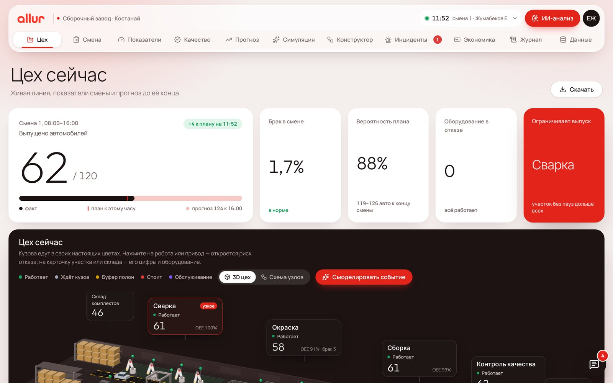
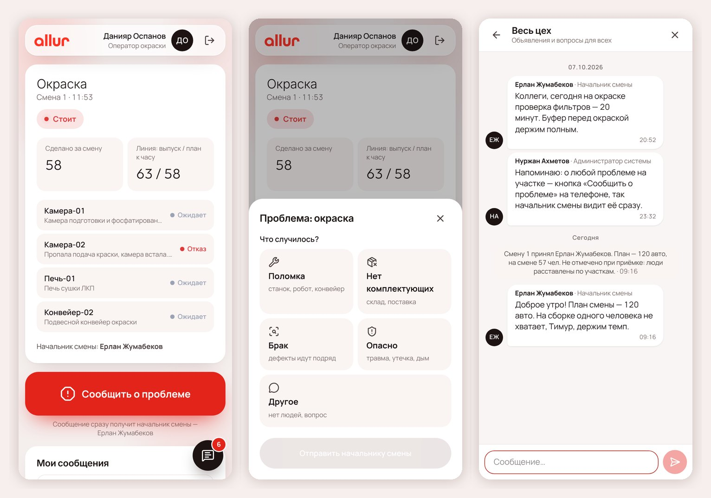
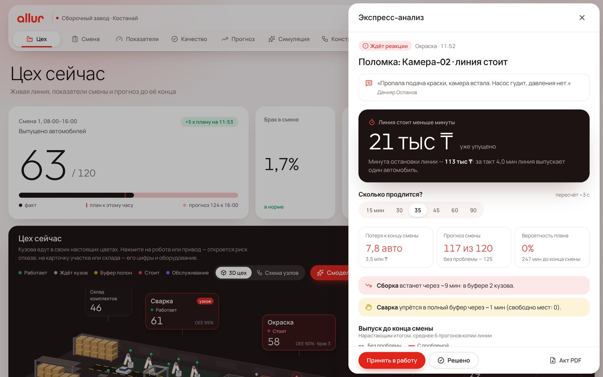

<p align="center">
  
</p>

## О проекте

Цифровой двойник сборочного завода в Костанае для **АО «Группа компаний АЛЛЮР»** (Qostanai Industry Hackathon 2026, кейс 2).
Двойник в реальном времени показывает производство целиком: от склада комплектующих до готового автомобиля.

- **Рабочий** с телефона сообщает о проблеме на своём участке — за 10 секунд.
- **Начальник смены** сразу получает тревогу и за минуту видит, во что обойдётся проблема до конца смены и какое действие выгоднее.
- **Руководитель** видит показатели против целей завода, прогноз плана, риски отказов и экономический эффект решений.

Также в системе: приёмка и сдача смен, чат производства, конструктор схемы цеха, симуляция «что будет, если»,
журнал всех действий и фирменные PDF-документы.

<p align="center"></p>
<p align="center"></p>
<p align="center"></p>

## Как запустить

Нужен только **Docker** (Docker Desktop на Windows/macOS или Docker Engine с Compose v2 на Linux).

```bash
git clone <адрес репозитория> allur-twin-ai
cd allur-twin-ai
docker compose up --build
```

Откройте **http://localhost:8080**. Первый запуск занимает 2–3 минуты, дальше — секунды.
База уже наполнена данными кейса, историей производства, сотрудниками и сменами.

| Действие | Команда |
|---|---|
| Остановить | `Ctrl+C` или `docker compose down` (данные сохраняются) |
| Запустить снова | `docker compose up -d` |
| Начать с чистой базы | `docker compose down -v && docker compose up --build` |

### Вход

Вход по PIN-коду или по логину и паролю. На экране входа есть список демо-доступов — нажмите строку, и данные подставятся.
Новый сотрудник подаёт заявку на экране входа, администратор подтверждает её в разделе «Сотрудники».

| Роль | Логин | PIN / пароль |
|---|---|---|
| Администратор | `admin` | `0000` |
| Руководитель производства | `director` | `1111` |
| Начальник смены | `smena1` | `2222` |
| Рабочий окраски | `okraska` | `3333` |

Экран рабочего для телефона — **http://localhost:8080/work**. С телефона в той же сети замените `localhost`
на адрес компьютера, например `http://192.168.1.10:8080`.
