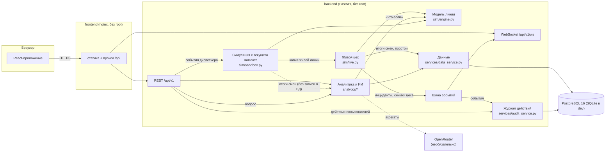

# Архитектура цифрового двойника завода АЛЛЮР

## Главные решения

**Симуляция с текущего момента — песочница.** `POST /sandbox` берёт точную копию живой линии,
вносит события (поломка, поставка, брак, замедление) и проигрывает её до конца смены/дня с событиями
и без — 6–10 пар прогонов на общих случайных числах. Основной прогон пишет кадры раз в 30 с цехового
времени (ответ сжимается gzip: ~5 МБ JSON → ~90 КБ). Пока интерфейс в режиме симуляции, каждый запрос
несёт `X-Sandbox: <id>`: зависимость `ScopeDep` подменяет аналитику и ассистента на копии, которые
читают набор данных «база + итоги смен из симуляции». В БД ничего не пишется, живой цех не трогается.
Песочница хранится в памяти 2 часа, одна на роль.

**Одна модель линии на два режима.** `sim/engine.py` — дискретная модель: участки с циклом,
буферы между ними, отказы оборудования по наработке на отказ, брак, поставки комплектов.
Живой цех шагает ею в реальном времени (× скорость), сценарии «что если» прогоняют ею день
за доли секунды. Поэтому то, что видно на экране, и то, что считает сценарий, — одно и то же.

**Модель откалибрована по данным.** Брак на участках берётся из текущего тренда аналитики,
циклы — из такта плана (8 ч / 120 = 240 с), отказы — из истории простоев. После загрузки
новых данных калибровка обновляется.

**Двойник пишет историю.** В конце смены живой цех записывает итоги (выпуск, брак, время работы)
и простои в те же таблицы, что и данные заказчика, с пометкой источника `live`. Аналитика
сразу их учитывает.

**Модель завода в одном месте.** `domain/plant.py` описывает участки, оборудование, модели,
смены и цели. Код оборудования совпадает с данными заказчика (ABB-01, Камера-02, Конвейер-03),
поэтому загруженные таблицы сопоставляются автоматически.

**Аналитика — чистые функции.** Каждый модуль в `analytics/` принимает набор данных и возвращает
результат, без сети и глобального состояния — их легко тестировать (см. `tests/test_analytics.py`).
`services/analytics_service.py` кэширует тяжёлые расчёты до изменения данных.

**Интеграция с реальным заводом.** Чтобы подключить MES/SCADA, достаточно заменить источник событий:
вместо `LineSim` в живом цехе — адаптер, который получает те же события (кузов прошёл пост, отказ,
ремонт) из системы завода. Аналитика, интерфейс и сценарии не меняются.

**Журнал всего, что происходит.** `AuditService` подписан на шину событий (инциденты, закрытие
смен) и вызывается из роутов (вход, управление цехом, симуляции, сценарии, загрузки, вопросы ИИ,
выгрузки, схемы конструктора, ошибки 403/500). Записи — в таблице `audit_log`, отдаются через
`GET /journal` с фильтрами и выгружаются в Excel/CSV. Запись в журнал никогда не роняет запрос.

**Сотрудники, роли и смены.** Вход — по одному PIN или по логину и паролю (`services/user_service.py`):
секрет хранится хэшем PBKDF2 и HMAC-ключом для поиска по PIN (PIN и пароли у всех разные); после
5 ошибок сотрудник блокируется на 5 минут, плюс лимит попыток с адреса. Токен подписан HMAC и несёт id, роль,
ФИО, должность и участок; права (`core/security.py` → `GRANTS`) проверяются зависимостями `ViewerDep`,
`ShiftDep`, `ReporterDep`, `UsersAdminDep`. Начальник смены принимает и закрывает смену
(`services/shift_service.py`) — сессия хранит план, итоги и все события смены для отчёта.

**Сигнал с участка → анализ за минуту.** Рабочий отправляет `POST /problems` с экрана `/work`.
`incident_service.report` создаёт инцидент с автором; если линия стоит — живой цех останавливает
оборудование (`live.fail(..., incident_id)`), событие `problem.reported` уходит по WebSocket всем
начальникам. `GET /incidents/{id}/impact` (`analytics/impact.py`) берёт копию живой линии и прогоняет
её до конца смены с проблемой и без, оценивает запас буферов и варианты действий; цена минуты — маржа
автомобиля / такт. При закрытии инцидента с описанием «что сделано» оборудование в двойнике чинится,
а простой и потери дописываются в инцидент.

**Рекомендации и экономика.** `analytics/prescriptive.py` строит кандидатов действий (узкое место,
рискованное оборудование, брак) и проверяет каждое на модели рабочего дня против базового; ценность —
с учётом недовыполнения плана месяца. `services/advice_service.py` считает их в фоне и кэширует до
изменения данных, параметров или экономики. `analytics/economy.py` — экономика завода: маржинальный доход,
труд и накладные, потери по участкам и оборудованию, потенциал их устранения.

**Схема цеха из конструктора.** Один проект конструктора отмечен как схема цеха
(`services/floor_layout_service.py`, `PUT /layouts/floor`). Узлы, совпадающие с участками завода,
показывают живые цифры, а их параметры (цикл, брак, буфер, надёжность) становятся параметрами живой
модели; новые узлы считает модель схемы в браузере. Остальные проекты — макеты: цех их не видит.
Менять схему цеха может только администратор.

**База данных: Supabase + локальное зеркало.** `db/failover.py` — тот же интерфейс, что у обычной базы,
но внутри две: основная (Supabase, `SUPABASE_DB_URL`) и локальная. Пока Supabase доступен, локальная —
зеркало (полная копия раз в `DB_MIRROR_MIN` минут). Два неудачных ping или обрыв соединения в запросе —
мгновенный переход на зеркало; связь вернулась — внесённое за время отключения переносится обратно.
`schema.lock_down_rest_api` включает RLS и снимает права `anon`/`authenticated`, чтобы REST API Supabase
не отдавал данные. Подробно — [SUPABASE.md](SUPABASE.md).

**Чат производства.** `services/chat_service.py`: каналы «Весь цех», «Штаб смены», каналы участков и личные
переписки `dm:<id>-<id>`. Ответы с цитатой, правка и удаление своих сообщений, фото (таблица `chat_files`,
проверка сигнатуры, до 6 МБ), непрочитанные и «прочитано». По WebSocket приходят `chat.message`,
`chat.updated`, `chat.read`, `chat.typing` и `presence` — фильтр на сервере отправляет их только тем,
кому канал виден. События публикуются из любого потока: `EventBus` доставляет их в очереди клиентов
через `call_soon_threadsafe`.

**Параметры линии.** `services/params_service.py` хранит переопределения цикла, брака, наработки на
отказ и времени ремонта по участкам; `live.apply_params` применяет их к работающей модели без перезапуска,
«что если» и рекомендации считают от них же.

**Документы.** `reports/pdf.py` — движок фирменных документов на reportlab: бланк с логотипом Аллюра,
реквизиты, номер документа, кто сформировал и должность, блоки (показатели, графики, таблицы, выводы,
шаги), подписи и нумерация «Стр. N из M»; шрифты Manrope/Outfit встроены. `reports/documents.py`
собирает из аналитики 12 документов (`GET /documents/{page}.pdf`, акт `GET /documents/incident/{id}.pdf`).
Excel формирует `reports/pages.py` + `services/excel.py`, PNG — браузер.

**Набор данных.** `services/dataset_service.py` выгружает всё, что внесли люди, в один JSON и загружает
обратно; `app/seed/dataset.json`, если он есть, загружается при первом старте. Без него стартует демо-набор
(`services/demo_seed.py`): сотрудники, 14 дней смен с инцидентами и журналом, проекты конструктора.

**Конструктор завода.** Узловой редактор на React Flow (`features/builder`). Схема — граф узлов
(склад, станок, сборка, контроль, буфер, выпуск) и связей. Мониторинг считает модель потока прямо
в браузере (`engine.ts`): изделия «тянутся» от выпуска к складу, станки ломаются по наработке на
отказ с учётом износа, датчики температуры и вибрации дают тревоги до отказа. Узлы подписаны только
на свои показатели, а при отдалении схемы показываются упрощённо — поэтому сотни станков не тормозят
интерфейс. Схемы хранятся в таблице `builder_layouts` (`/layouts`).

## Поток данных при загрузке файла

1. `ingest/tables.py` читает .docx/.xlsx/.xls/.csv/.tsv/.txt/.json или текст из буфера и определяет таблицу
   по смыслу заголовков (словарь синонимов: «Участок», «Цех», «Area» → участок).
2. `data_service.import_file` сопоставляет участки и оборудование со схемой завода и заменяет строки за те же даты.
3. Кэш набора данных сбрасывается → аналитика пересчитывается → модель цеха перекалибровывается.
4. `analytics/checks.py` ищет противоречия и показывает их в разделе «Данные».
