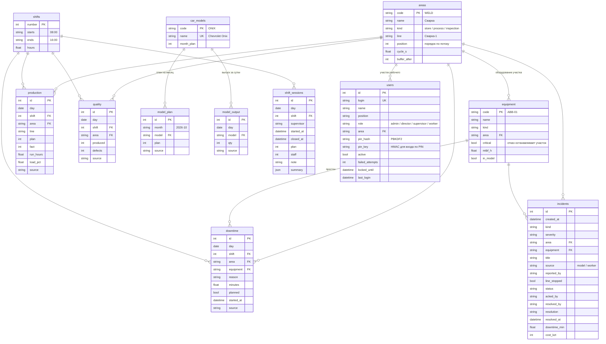

# База данных цифрового двойника завода АЛЛЮР

В `docker compose` работает **PostgreSQL 16** (сервис `db`). Данные лежат в томе `allur-db` и
переживают перезапуск и пересборку. Без docker (разработка, тесты) та же схема работает на SQLite.

## Как подключиться

| Параметр | Значение |
|---|---|
| Хост | `localhost` (только с этого компьютера) |
| Порт | `5432` (меняется `DB_PORT` в `.env`) |
| База / пользователь | `allur` / `allur` |
| Пароль | `POSTGRES_PASSWORD` из `.env`; если пусто — `allur_local_dev` (только для локальной разработки) |

- **DBeaver / pgAdmin / DataGrip:** новое подключение PostgreSQL с параметрами выше.
- **Консоль:** `docker compose exec db psql -U allur`
- **Резервная копия:** `docker compose exec db pg_dump -U allur allur > allur_backup.sql`
- **Начать с чистой базы:** `docker compose down -v && docker compose up --build`. Данные заказчика и
  история загрузятся заново.

В production сервер не запустится с паролем базы по умолчанию.

## Схема

Таблицы делятся на три группы.

- **Справочники.** Заполняются из модели завода (`backend/app/domain/plant.py`) при каждом старте.
- **Факты.** Это таблицы заказчика из кейса. Каждый факт ссылается на справочники внешними ключами,
  поэтому строка с несуществующим участком в базу не попадёт.
- **Журналы.** Сотрудники, сменные сессии, инциденты с авторами и решениями, журнал действий,
  история загрузок, параметры линии и экономика, проекты конструктора.



Прочие таблицы:

- `imports` — журнал загрузок файлов.
- `settings` — экономические допущения, параметры линии и какой проект конструктора — схема цеха (`floor_layout`).
- `builder_layouts` — проекты конструктора (схема в JSON, автор, время изменения).
- `audit_log` — журнал всех действий: кто, когда, что сделал, подробности.
- `meta` — версия схемы.

### Откуда строка: поле `source`

| Значение | Происхождение |
|---|---|
| `customer` | файл заказчика (кейс 2, 01–02.10.2026) |
| `history` | сгенерированная история для обучения моделей |
| `live` | итоги смены, записанные живым цехом |
| `import` | файл, загруженный в разделе «Данные» |

### Ограничения целостности

- **Внешние ключи** на участки, оборудование, модели и смены.
- **Уникальность.** Для `production` и `quality` одна строка на сутки, смену и участок. Для `model_plan`
  одна строка на месяц и модель. Повторная загрузка файла заменяет строки, а не дублирует их.
- **Проверки значений.** Количество не бывает отрицательным. Брака не больше, чем выпущено. Время
  работы от 0 до 24 ч. `source`, `severity` и `status` принимают только допустимые значения.
- **Незнакомое оборудование или модель.** Если в загруженном файле встретилось оборудование или модель,
  которых нет в модели завода, они регистрируются в справочнике с пометкой `in_model = false`. Строка
  при этом не теряется.
- **Перезапуск.** При старте живой цех заново «проживает» сегодняшнюю смену с 08:00. Перед этим
  сегодняшние автоматические записи очищаются, поэтому дублей нет.

## Готовые представления для отчётов

В представлениях русские названия участков и уже посчитанные проценты. Их можно открывать в Excel,
BI или SQL-клиенте как обычные таблицы.

| Представление | Что внутри |
|---|---|
| `v_daily_summary` | сутки: план, выпуск линии, % брака, внеплановый простой (мин) |
| `v_shift_output` | выпуск по сменам и участкам: план, факт, отклонение, % плана, загрузка |
| `v_quality` | брак по сменам и участкам, % брака |
| `v_downtime` | журнал простоев с названием оборудования и признаком критичности |
| `v_equipment_downtime` | сколько раз и сколько минут стояло каждое оборудование (для Парето) |
| `v_model_plan` | план и факт по моделям за месяц |

### Примеры запросов

```sql
-- Последние 7 дней: выполнение плана и брак
SELECT * FROM v_daily_summary ORDER BY day DESC LIMIT 7;

-- Где брак выше нормы 2%
SELECT day, shift, area, defect_pct FROM v_quality WHERE defect_pct > 2 ORDER BY day DESC;

-- Топ оборудования по внеплановым простоям
SELECT code, name, area, stops, minutes FROM v_equipment_downtime ORDER BY minutes DESC LIMIT 5;

-- Интервалы между обрывами цепи Конвейера-03 (видно, что они сокращаются)
SELECT day, day - LAG(day) OVER (ORDER BY day) AS days_since_previous
FROM downtime WHERE equipment = 'Конвейер-03' AND reason = 'Обрыв цепи' ORDER BY day;

-- Незакрытые инциденты
SELECT created_at, severity, title FROM incidents WHERE status <> 'resolved' ORDER BY created_at DESC;
```

## Изменение схемы

Схема описана в `backend/app/db/models.py`, а справочники и представления в `backend/app/db/schema.py`.
При несовместимом изменении таблиц нужно повысить `SCHEMA_VERSION`. Старая база тогда пересоздастся
при старте:

- данные заказчика, история, сотрудники, демо-смены и проекты конструктора загрузятся заново;
- если есть `backend/app/seed/dataset.json` — загрузится он (сохранённый набор из «Данные → Набор данных»).
